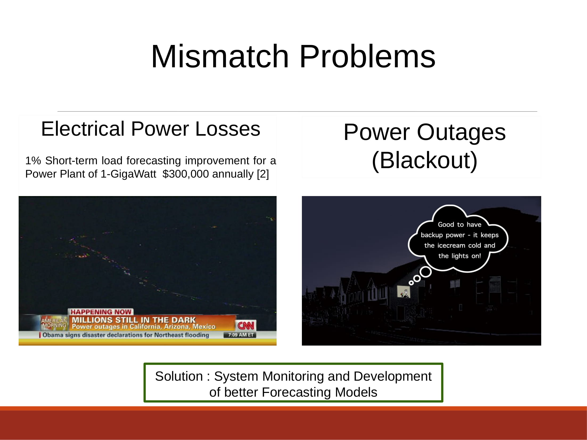
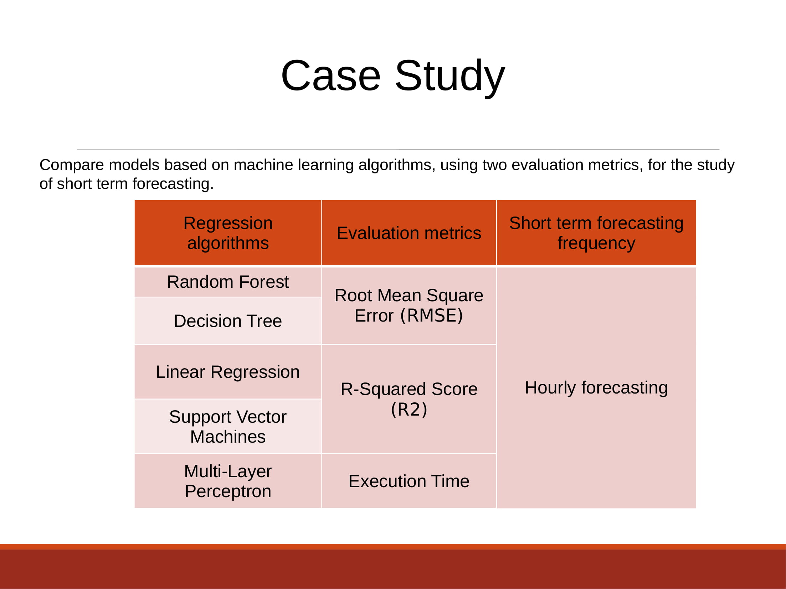
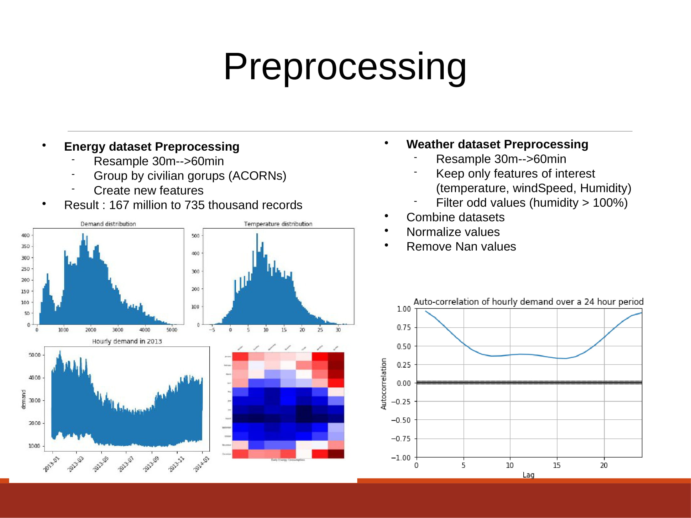
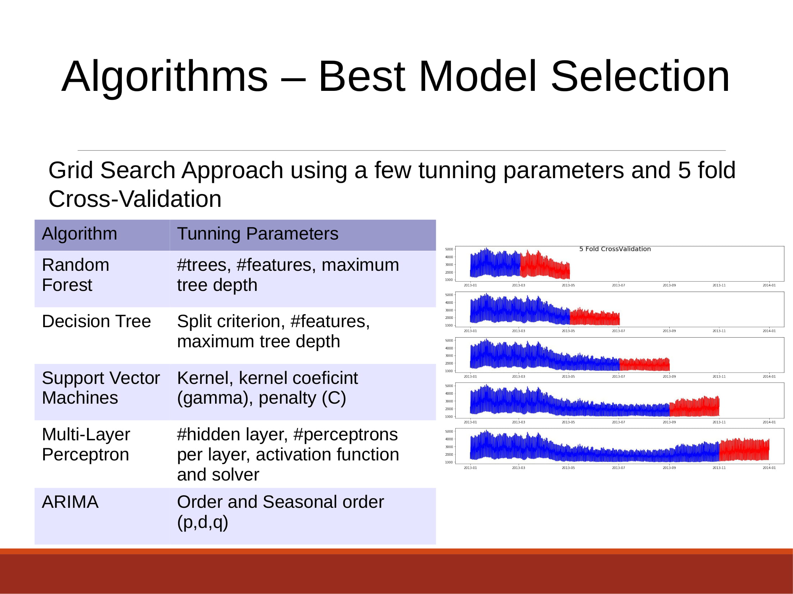
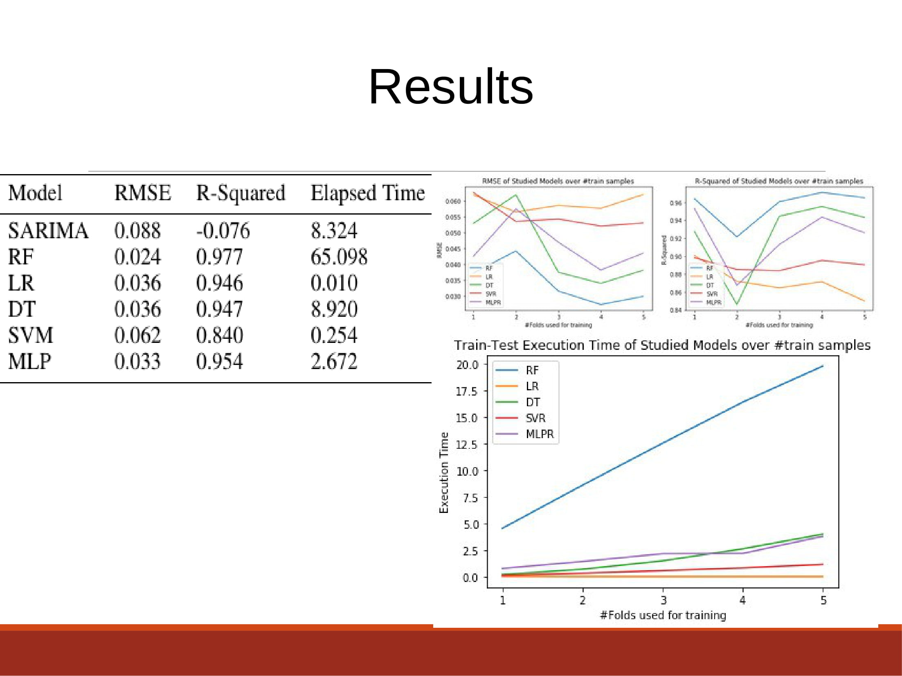
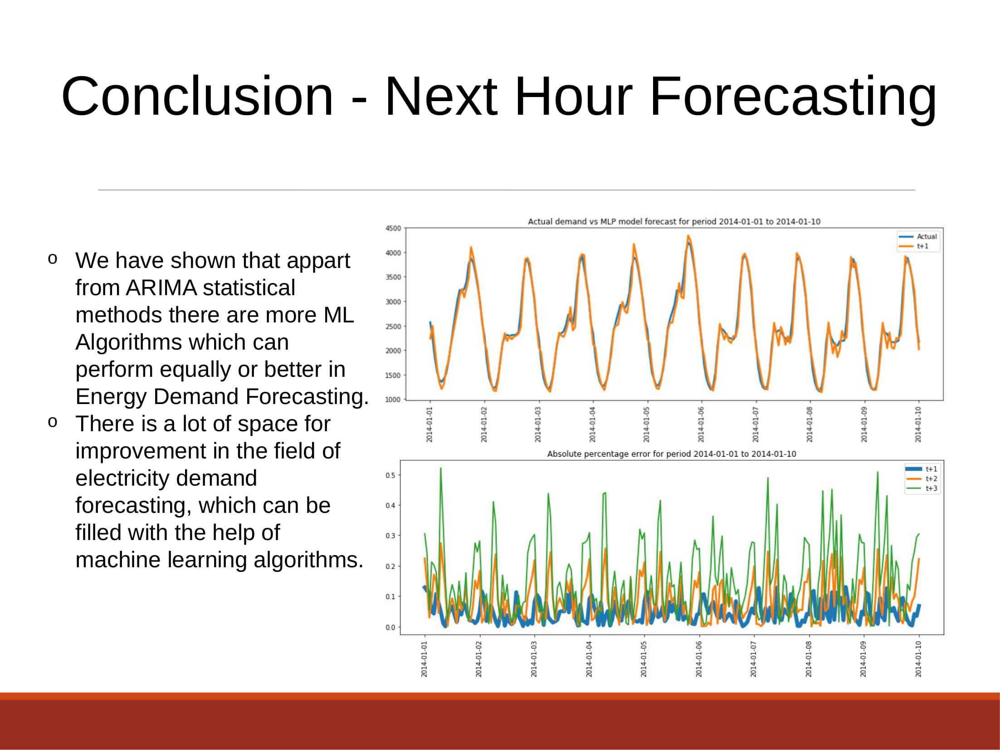

# Electricity Demand Forecasting based on Smart Meter Data
Based on the Kaggle dataset (https://www.kaggle.com/jeanmidev/smart-meters-in-london), the goal of this study is to compare several well known machine learning algorithms on the task of time series forecasting. A report is also provided showing the results of the comparison.

The studied algorithms are:
* SARIMA
* RANDOM FOREST
* LINEAR REGRESSION
* DECISION TREES
* SUPPORT VECTOR MACHINES
* MULTILAYER PERCEPTRON

### The problem statement

### Case Study

em.jpg)
### Data Preprocessing
em.jpg)
### Forecasting Algorithms Comparison

### Results

### Next Hour Forecasting

## Study Full Report
The full report of this study can be found under the [report directory of this repo](report/Electricity_Demand_Forecasting_based_on_Smart_Meter_Data.pdf)

## Study Results Presentation
A quick presentation on the study can be found under the  of this repo.
